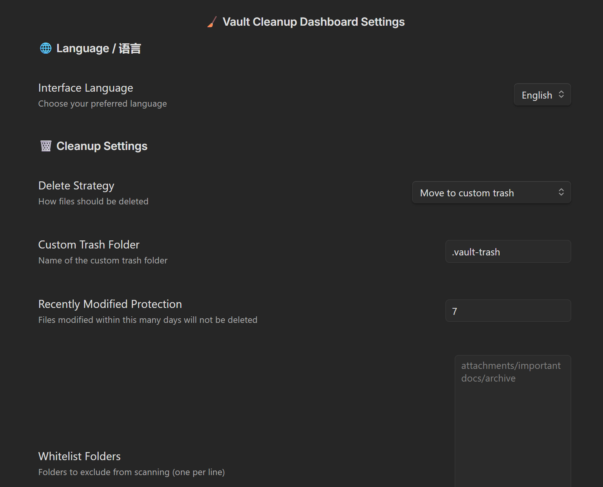
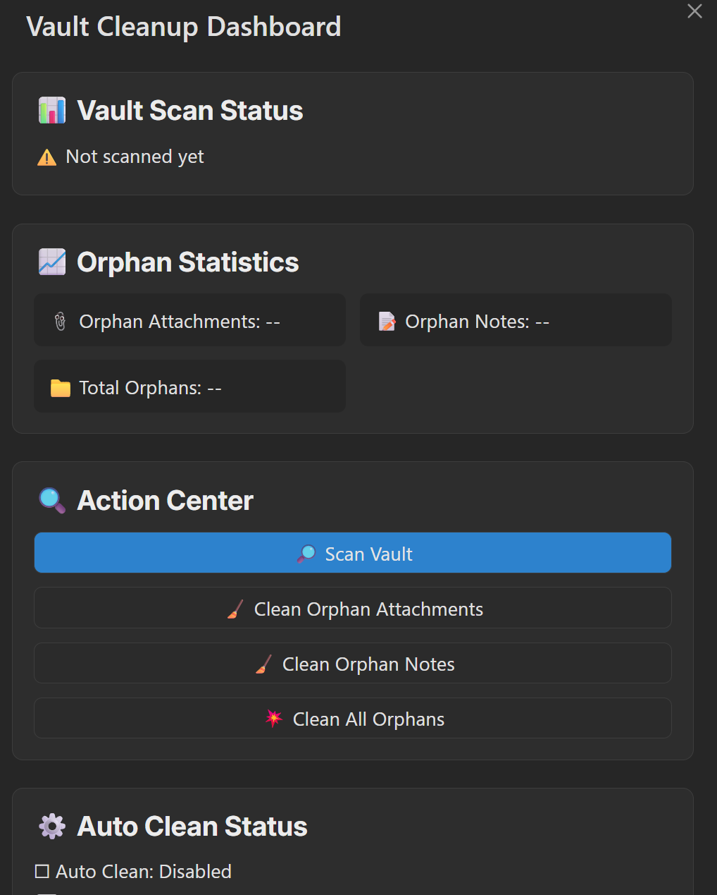

# Vault Cleanup Dashboard

[English](README.md) | [中文](README_CN.md)

An Obsidian plugin for intelligently cleaning up orphaned files and attachments in your vault.

## Features

- **Visual Dashboard**: One-click access via ribbon icon with real-time scan status and statistics
- **Smart Detection**: Accurately identifies orphaned notes, attachments, and other files, including Canvas file links
- **Selective Deletion**: Preview and confirm files before deletion to prevent accidental loss
- **Custom Recycle Bin**: Deleted files are moved to a custom trash folder (default: `.vault-trash`) for easy recovery
- **Scheduled Auto-Cleanup**: Automatically scan and clean orphaned attachments at customizable intervals (in days)
- **File Protection**: Recently modified files are automatically protected (default: 7 days) to prevent accidental deletion
- **Flexible Configuration**: Supports whitelist folders, regex ignore patterns, custom attachment paths, and more
- **Bilingual Interface**: Full internationalization support with English and Chinese

## How It Works

### Orphan File Detection

A file is considered **orphaned** when it meets ALL of the following conditions:

- **No inbound links**: No other file links to it
- **No outbound links**: It doesn't link to any other file (including attachments - linking to an attachment means it's not orphaned)
- **No canvas references**: Not referenced in any Canvas file

### Attachment Detection

A file is classified as an **attachment** if it matches your configured attachment paths:

| Path Type | Example | Matching Logic |
|-----------|---------|----------------|
| Absolute path | `attachments` | File parent path or file path starts with it |
| Relative path | `./attachments` | File path starts with `attachments` (default) or any parent directory name matches `attachments` (alternative algorithm) |

### Excluded from Scanning

- Files in whitelisted folders
- Files matching ignore patterns (regex)
- Recently modified files (within protection period, default: 7 days)
- Files in `.obsidian/` and other system folders

## Screenshots





## Usage

### Quick Start

1. Click the **Vault Cleanup Dashboard** icon in the sidebar to open the cleaning dashboard
2. Click **Scan Vault** to find orphaned files
3. Review statistics to see the number of orphaned files
4. Choose to clean attachments, notes, or all orphaned files as needed
5. Confirm the file list in the preview modal and execute cleanup

### Command Palette

Quick access via Obsidian's command palette (`Ctrl/Cmd + P`):

- **Open Dashboard** - Open the visual cleaning dashboard
- **Clean Orphaned Attachments** - Scan and clean orphaned attachments only
- **Clean Orphaned Notes** - Scan and clean orphaned notes only
- **Clean All Orphaned Files** - Scan and clean all types of orphaned files

## Installation

### From Community Plugins (Recommended)

1. Open Obsidian Settings → Community Plugins → Browse
2. Search for "Vault Cleanup Dashboard"
3. Click Install and Enable

### Manual Installation

1. Download the latest release from [Releases](https://github.com/wlunan/vault-cleaner/releases)
2. Extract the plugin folder into your vault's `.obsidian/plugins/` directory
3. Open Obsidian Settings → Community Plugins → Enable "Vault Cleanup Dashboard"

## Configuration

### Cleanup Settings

| Setting | Description | Default |
|---------|-------------|---------|
| **Delete Strategy** | Move to custom trash or permanent delete (dangerous) | Custom trash |
| **Custom Trash Path** | Folder location for deleted files | `.vault-trash` |
| **Recently Modified Protection** | Files modified within this many days are protected | 7 days |
| **Whitelist Folders** | Folders excluded from scanning (one per line) | None |

### Auto-Cleanup Settings

| Setting | Description | Default |
|---------|-------------|---------|
| **Enable Auto-Cleanup** | Automatically clean orphaned attachments on schedule | Disabled |
| **Cleanup Interval** | Frequency of auto-cleanup execution (days) | 3 days |
| **Check on Vault Open** | Run auto-cleanup check when vault is opened | Enabled |
| **Check on Plugin Load** | Run auto-cleanup check when plugin is loaded | Enabled |

> **Note**: Auto-cleanup only affects attachments and will not delete note files, ensuring your important content is safe.

### Advanced Settings

| Setting | Description | Default |
|---------|-------------|---------|
| **Override Attachment Folders** | Custom attachment storage locations (one per line) | Follows vault settings |
| **Ignore Patterns** | Regex patterns; matching files will be excluded | None |
| **Test Settings** | Test if a path is ignored (red = ignored, green = kept) | - |
| **Alternative Attachment Algorithm** | Enable if attachments in subfolders are not detected | Disabled |

## Development

### Prerequisites

- [Node.js](https://nodejs.org/) (v16 or higher)
- npm or yarn

### Setup

```bash
# Clone the repository
git clone https://github.com/wlunan/vault-cleaner.git
cd vault-cleaner

# Install dependencies
npm install
```

### Development Commands

```bash
# Development mode with hot reload (watches for changes and rebuilds)
npm run dev

# Build for production
npm run build
```

### Local Testing in Obsidian

#### Method 1: Using Test Vault (Recommended)

1. Run `npm run dev` to start the development server
2. Open the `test-vault` folder in Obsidian as a vault
3. Enable the plugin in Settings → Community Plugins
4. Changes will auto-reload when you modify source files

#### Method 2: Copy to Your Vault

1. Run `npm run build` to build the plugin
2. Copy the following files to your vault's `.obsidian/plugins/vault-cleaner/` directory:
   - `main.js`
   - `manifest.json`
   - `styles.css`
3. Enable the plugin in Settings → Community Plugins
4. Run `npm run dev` for auto-rebuild, then reload Obsidian to see changes

#### Method 3: Using hot-reload Plugin

1. Install the [hot-reload](https://github.com/pjeby/hot-reload) plugin in your vault
2. Create a file named `.hot-reload` in your vault root
3. Run `npm run dev` - changes will auto-reload without restarting Obsidian

### Release

```bash
# Bump version (updates package.json, manifest.json)
npm run version

# Commit and tag
git add .
git commit -m "Release vX.Y.Z"
git tag vX.Y.Z
git push && git push --tags
```

Create a new release on GitHub with the built files (`main.js`, `manifest.json`, `styles.css`).

## Project Structure

```
src/
├── main.ts              # Plugin entry point, registers commands and ribbon icon
├── dashboardModal.ts    # Visual cleaning dashboard
├── scanService.ts       # Orphan file scanning service
├── actionService.ts     # File operation service (delete/restore)
├── previewModal.ts      # Delete preview confirmation modal
├── autoCleanScheduler.ts # Scheduled auto-cleanup scheduler
├── settings.ts          # Settings interface
└── locales/             # Internationalization language packs
    ├── zh-CN.ts         # Chinese
    └── en-US.ts         # English
```

## License

MIT

## Acknowledgments

- This plugin is a fork of [nuke-orphans-plugin](https://github.com/ozntel/nuke-orphans-plugin), enhanced with a visual dashboard, scheduled auto-cleanup, file protection mechanisms, and more. Thanks to the original author for their excellent work.
- Thanks to all developers contributing to the Obsidian community.
